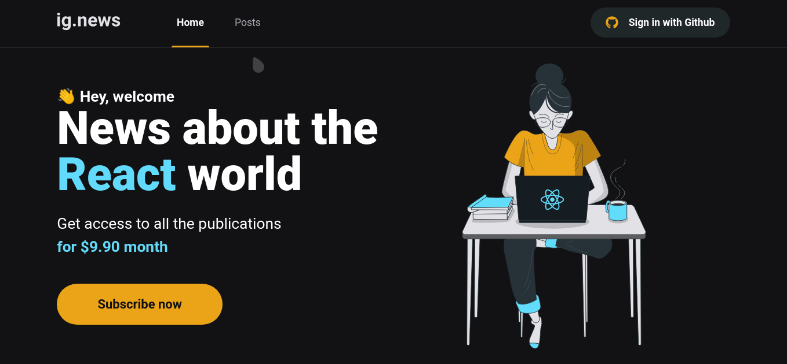

<h1 align="center">
   
</h1>
<h1 align="center" widht="50%">
  
  
  
  
</h1>

## ⚡️ The Project
 Ignews is a NextJS aplication where you can see posts and subscribe to the service.
  
## 🎯 Features
 - Stripe connection
 - Fauna database
 - Prismic CMS
 - Static Site Generation
 - Server Side Rendering
 - Github authentication                                                                                                          
  
## 🖥️ Used Tecnologies
 - [NextJS](https://nextjs.org/)
 - [Sass](https://sass-lang.com/)
 - [Next-Auth](https://next-auth.js.org/)
 - [Prismic](https://prismic.io/)

## ⚙️ Dependencies
 - [Yarn](https://yarnpkg.com/)
 
## 🚀️ Getting Started

1. Clone this repository: 

```bash
git clone https://github.com/avnerjose/reactjs-nextjs-ignews.git && cd reactjs-nextjs-ignews
```
2. Install all dependencies

```bash
yarn
```
3. Start the app
```bash
yarn dev
```
4. Open [localhost:3000](http://localhost:3000) to see the app working
